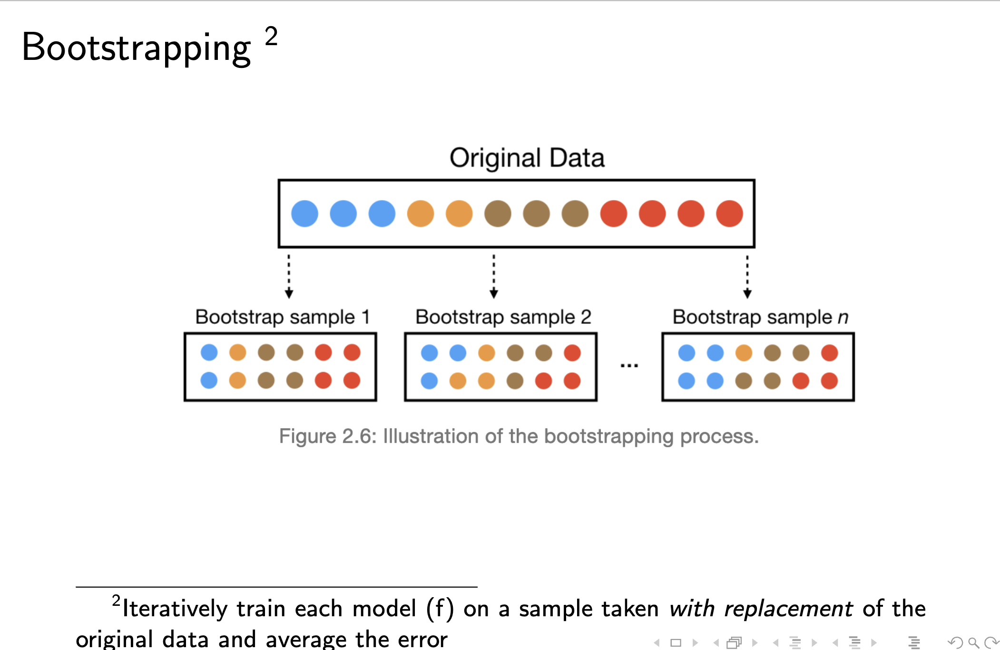

Math operators found at https://rpruim.github.io/s341/S19/from-class/MathinRmd.html
```{r}

library(tidymodels)
library(knitr)
library(dplyr)
library(tidyverse)
library(tidyr)
library(ggplot2)
library(readr)
library(caret)
library(e1071)
library(caTools)
library(rsample)

```
# Lecture 3 PH + in class

##In class assignment

###Problem 1.1/1.2
```{r}
boston <- read.delim("boston_corrected.txt", skip = 9, header = TRUE)
dim(boston)
sum(is.na(boston))

```
###problem 3
```{r}
boston <- boston %>%
  select(-"OBS.",-"TOWN",-"TOWN.",-"TRACT",-"LON",-"LAT",-"MEDV")
# %>% is a piing function. Rather than specifying the variable i want to target for all operations I have already prompted the updated variable. Syntax boston <- select(boston,-"OBS.",-"TOWN",-"TOWN.",-"TRACT",-"LON",-"LAT",-"MEDV") would give same result. Piping is useful when you wish to to additional variable updates in a row.
```
###problem 4
```{r}
names(boston) <- tolower(names(boston))
#remember to save variable change to the updated variable using <- 
#Be aware that in this example the logic is:
#Names(boston) - the columns of df boston -, needs to be set to lower. We need to both save the lowercase names to our dataframe and specify we want them lower, as such names(boston)) is called twice.
```
###problem 5
```{r}
boston <- rename(boston,medv=cmedv)
head(boston)
```
###problem 6
```{r}
write_csv(boston, "BostonBI.csv")

#I'm using the readr write_csv functionality. It's smart and knows what to do regarding headers etc already. If you were to use base R I would do the function as follows

#write.csv(boston, file = "BostonBI.csv", na = "NA")
#specifying of additional parameters
```
##Problem 2.2
```{r}
boston1 <- boston %>%
  select(tax, medv)
  summary(boston1)
  cor(boston1)

```
###Problem 3

```{r}
ggplot(boston1, aes(x=tax)) + geom_density() + labs(x="US$")
```

###Problem 4
```{r}
ggplot(boston1, aes(x=tax)) + geom_histogram(binwidth = 5)
```
###problem 5
```{r}
attach(boston)
taxlabel <- c("low","medium","high")
tax_discrete <- 0 + (tax > 300) + (tax < 600)
tax2 <- factor(tax_discrete,0:2,taxlabel)

boston <- cbind(boston,tax2)

head(boston)
#Need to attach the dataframe in order to do the factorial operations. Could probably be solved by piping? Will add to later.
#First we define our string value factorial, taxlabel. Then we define the value parameters assigned to the string. If tax is less than 300, the value assigned is low, or 0. If between 300 and 600 value assigned is medium, or 1. If above 600 value assigned is high, or 3. The factor(tax_discrete,0:2,taxlabel) defines the range spread for string values of the factorial.

```
###6
```{r}
ggplot(boston, aes(x=tax,y=medv)) + geom_boxplot() + coord_flip()

## Coord_flip flips the x and y values. Used here for increased readability.

```
###problem 7
```{r}
ggplot(boston, aes(x=tax,y=medv)) +
  geom_point() + 
  ylim(0,50) + 
  # stat_smooth() 
  stat_smooth(method="lm")

#ggplot syntax = 
# aes = Aesthetic (udseende)
#geom = type of chart, point = scatter, boxplot = boxplot, histogram = histo.
#stat_smooth is a best fit model, you can define method of the fit by (method="x"), here "lm" is linear model fit

```


# Lecture 4


Matemathical model:

$$ (1) y_k = g_k(x1,..., x_n, z_1, z_L), =k = 1,K $$

Statistical model:

$$ (2)  y_k = f_k(x_1, .... , x_n) + e_k, k = 1,K $$

$f_k$ = Function of the observed inputs $$ f_k $$
 

$e_k$ = an additional random stochastic component / error term $$ e_k $$ 

If denoting $$X = (x_1,x_2,...,x_p)$$
  then (2) becomes $$y_k = f(X) + e_k$$

$f$ Is used as an estimation for new y observations, which helps us understand the mechanism that is produced by the data (y) output to help intervene in the future

For predictions:
- Focus on reducible errorfs
    
if: 
$$ E(Y-Ŷ)^2 = E[f(X)+e-f̂(X)]^ 2 $$
$$=$$
$$ [f(X)-f̂(X)]^2+Var(e)$$
Where $[f(X)-f̂(X)]^2$ is reducible and $Var(e)$is irreducible

For inference put focus on
-   Which predictors $X$ associate with response $y$
-   Magnitude & direction
-   relationship (Linear or other)
-   interaction effects 


ESTIMATION OF ƒ

1. Parametric
2. Non-parametric

*1. Parametric*

**'a priori assumption" : Relating to ro denoting reasoning or knowledge which proceeds from theoretical deduction rather than observation or experience, ie. "sexuality may be a factor but it cannot be assumed a priori"**

We fit the model based on our a priori assumptions. If we expect linear fit we estimate the parameters beta

$$ y ≈ ß_o+ß_1 X_1+ß_2 X_2+…+ß_p X_p $$
where *$ß_0,ß_1,ß_2 and  ß_p$* are our estimators

*2. Non-parametric*

No assumption; ƒ is very flexible
  Advantages: 
  Predictive accuracy
  Disadvantages: Large number og observations is required; overfitting risk; low interpretability
*-    will be covered in Machine Learning 2*


----
## Data partitioning


Split datasets into partitions, one for training and one for testing
Example:
From Tutoral 1 we know that

```{r}
library(rsample)
set.seed(123) 
split_1  <- initial_split(df, prop = 0.6)
train <- training(split_1)
test <- testing(1-split_1)
```
For above; 
Load rsample library for the utilties

Seed for reproductibility

define variable of split = split_1, where df is our dataframe or tabel.

Prop defines where the dataset is split, 0.6 = 60/40, 0.5 would equal 50/50, etc.

By defining test as testing(1-split_1) we use the remaining 40% of our dataset for test. 

**Approaches for partitioning**¨

(1) Random split  
  -   Tradtional technique
(2) Stratified split
  Considers target variable and groups before split

## expand with knowledge from https://bradleyboehmke.github.io/HOML/process.html
  
  
Re-sampling

```{r}
include_graphics("ML process.png")
```
  - Single training data leads to inaccurate results. To avoid this we utilize re-sampliung methods
  
  **k-fold cross validation**
```{r}
include_graphics("k-fold method.png")
```

  **bootstrapping**
```{r}

```
  
  
Use multiple split when practicing to get best results

Knowing this, the standard procedure for model building should be 
```{r}
include_graphics("Procedure modelling.png")
```
##Model evaluation criteria
###will be expanded upon

expand with knowledge from https://bradleyboehmke.github.io/HOML/process.html

**Regression models:**
  - MSE
  
  - RMSE
  
  - Deviance
  
  - MAE
  
  - R-squared
  
**Classification models**

  - Misclassification rate
  
  - Mean per class error

  - MSE
  
  - Cross-entropy
  
  - Gini index
  
  - Confusion matric
  
  - Accuracy, Precision, Sensitivity/Recall, Specificity
  
  - ROC and AUC*


## Errors

Training errors(MSE)
$$MSE = \frac{1}{n} \sum_{i = 1}^{n} (y_i - f̂(x_i))^2 $$

Testing error (test MSE)
$$Ave(y_o-f̂(x_o))^2$$
where $x_o,y_o$ are obs. not used to train

##overfitting
  Small train error
  
  *High test error*
  
  Our model(algorithm) is trying too hard to find a suited fit
  
  *Variance of fit* = Amount by which $f̂$ would change if estimated using different training set
  
  *bias of fit* = error introduced by approximating real-life problem in simple models
  
  *aim to minimize both*

$$E(y_0-f̂(x_o))^2 = Var(f̂(x_o)) + [bias(f̂(x_o))]^2 + Var(e)$$

where 

$E(y_0-f̂(x_o))$ = Expected test MSE

$Var(f̂(x_o$ = Variance of fit

$[bias(f̂(x_o))]$ = Bias of fit

$Var(e)$ = Irreducible error


##Lecture conclusions

Increase in method flexibility (more advanced methods, NN), we can reduce the prediction error (bias). Increasing flexibility does however have diminishing returns and will eventually increase our variance further than reducing our bias.

Machine learning has to one-size-fits-all model, we must utilize all tools and models available to us to treat each dataset independently. 


## Lecture 4 coding 🤓

Sample formula interfaces 
```{r}

ames <- AmesHousing::make_ames()
# Sale price as function of neighborhood and year old

lm_lm <- lm(Sale_Price ~Neighborhood + Year_Sold, data = ames)

#lm is used to fit linear models

lm_glm <- glm(Sale_Price ~Neighborhood + Year_Sold, data = ames, family = gaussian)

#glm is used to fit generalized linear models

lm_caret <- train(Sale_Price ~Neighborhood + Year_Sold, data = ames, method = "lm")
lm_caret

#train used as part of the Caret library. Documentation found in tfestimators package 


```


