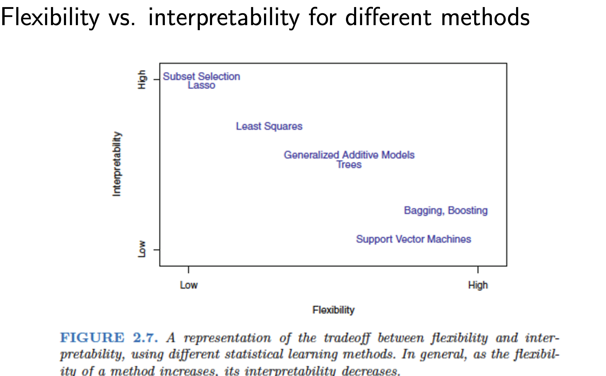
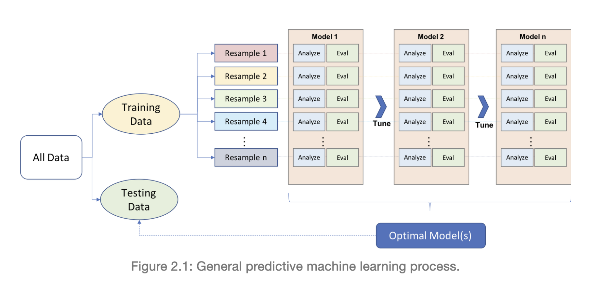
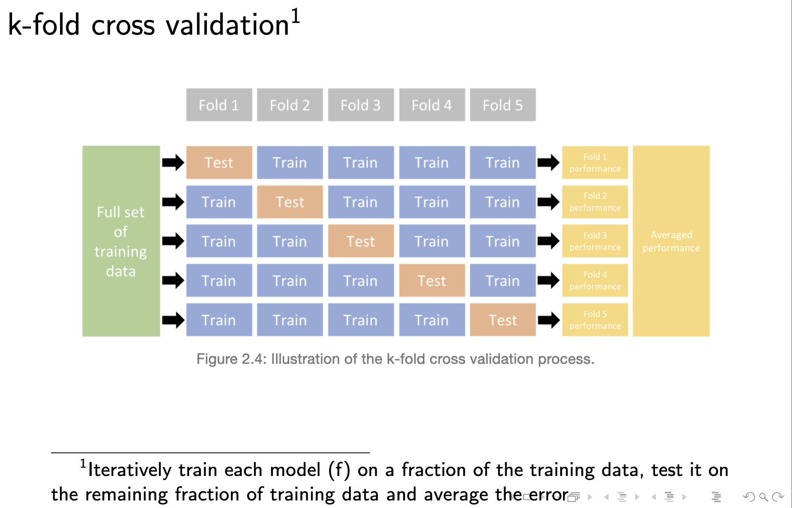
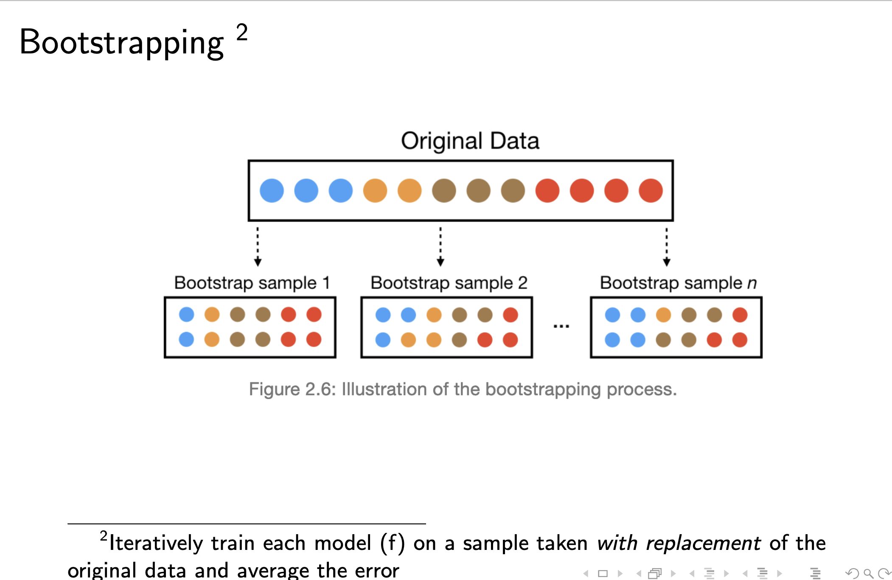
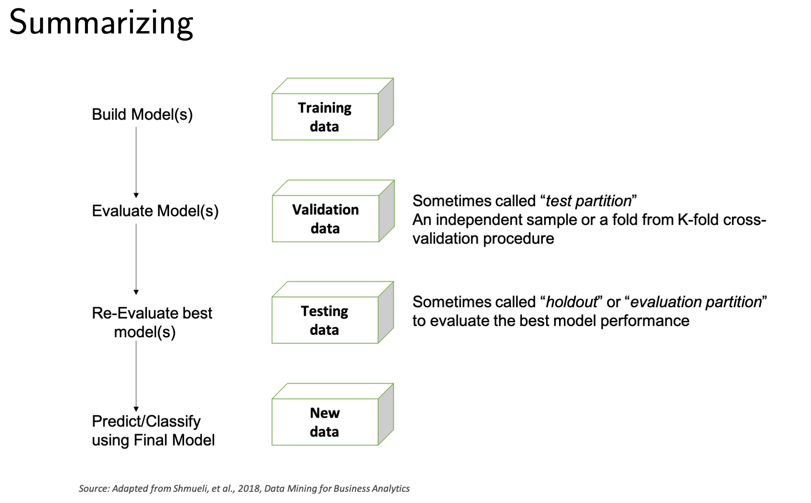
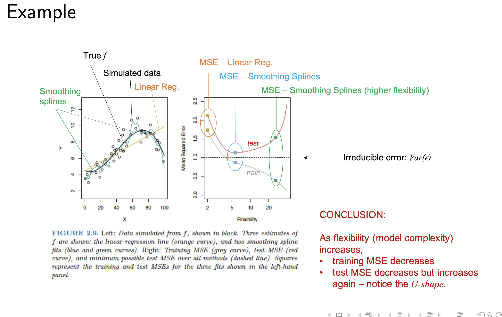

Math operators found at
<https://rpruim.github.io/s341/S19/from-class/MathinRmd.html>

```{r}

?Matrix
library(Matrix)
library(tidymodels)
library(knitr)
library(dplyr)
library(tidyverse)
library(tidyr)
library(ggplot2)
library(readr)
library(caret)
library(e1071)
library(caTools)
library(rsample)


```

# Lecture 3 PH + in class

## In class assignment

### Problem 1.1/1.2

```{r}
boston <- read.delim("boston_corrected.txt", skip = 9, header = TRUE)
dim(boston)
sum(is.na(boston))

```

### problem 3

%\>% is a piping function. Rather than specifying the variable i want to
target for all operations I have already prompted the updated variable.
Syntax boston \<-
select(boston,-"OBS.",-"TOWN",-"TOWN.",-"TRACT",-"LON",-"LAT",-"MEDV")
would give same result. Piping is useful when you wish to to additional
variable updates in a row.

```{r}
boston <- boston %>%
  select(-"OBS.",-"TOWN",-"TOWN.",-"TRACT",-"LON",-"LAT",-"MEDV")
```

### problem 4

remember to save variable change to the updated variable using \<-

Be aware that in this example the logic is:

Names(boston) - the columns of df boston -, needs to be set to lower. We
need to both save the lowercase names to our dataframe and specify we
want them lower, as such names(boston)) is called twice.

```{r}
names(boston) <- tolower(names(boston))

```

### problem 5

```{r}
boston <- rename(boston,medv=cmedv)
head(boston)
```

### problem 6

I'm using the readr write_csv functionality. It's smart and knows what
to do regarding headers etc already. If you were to use base R I would
do the function as follows

write.csv(boston, file = "BostonBI.csv", na = "NA") specifying of
additional parameters

```{r}
write_csv(boston, "BostonBI.csv")

```

### Problem 2.2

```{r}
boston1 <- boston %>%
  select(tax, medv)
  summary(boston1)
  cor(boston1)

```

### Problem 3

```{r}
ggplot(boston1, aes(x=tax)) + geom_density() + labs(x="US$")
```

### Problem 4

```{r}
ggplot(boston1, aes(x=tax)) + geom_histogram(binwidth = 5)
```

### problem 5

Need to attach the dataframe in order to do the factorial operations.
Could probably be solved by piping? Will add to later.

First we define our string value factorial, taxlabel. Then we define the
value parameters assigned to the string. If tax is less than 300, the
value assigned is low, or 0. If between 300 and 600 value assigned is
medium, or 1. If above 600 value assigned is high, or 3.

The factor(tax_discrete,0:2,taxlabel) defines the range spread for
string values of the factorial.

```{r}
attach(boston)
taxlabel <- c("low","medium","high")
tax_discrete <- 0 + (tax > 300) + (tax < 600)
tax2 <- factor(tax_discrete,0:2,taxlabel)

boston <- cbind(boston,tax2)

head(boston)


```

### Problem 6

Coord_flip flips the x and y values. Used here for increased
readability.

```{r}
ggplot(boston, aes(x=tax,y=medv)) + geom_boxplot() + coord_flip()
```

###problem 7 ggplot syntax = aes = Aesthetic (udseende) geom = type of
chart, point = scatter, boxplot = boxplot, histogram = histo.
stat_smooth is a best fit model, you can define method of the fit by
(method="x"), here "lm" is linear model fit

```{r}
ggplot(boston, aes(x=tax,y=medv)) +
  geom_point() + 
  ylim(0,50) + 
  # stat_smooth() 
  stat_smooth(method="lm")


```

# Lecture 4

## Predictive learnings

Input = independent variables (IV) = features = predictors = X

$$x_1,…x_n$$

Output = Dependent variables (DV) = response = Y

$$Y_1,…,y_m$$

other var. that affect Y, but those values are neither observed nor
controlled (noise?)

$$Z_1,…Z_k$$

### Matemathical model

$$ (1) y_k = g_k(x1,..., x_n, z_1, z_L), =k = 1,K $$

$y_k$ can be any row in our dataset

### Statistical model

$$ (2)  y_k = f_k(x_1, .... , x_n) + e_k,  k = 1,K $$

$f_k$ = Function of the observed inputs $$ f_k $$

$e_k$ = an additional random stochastic component / error term $$ e_k $$

If denoting $$X = (x_1,x_2,...,x_p)$$ then (2) becomes
$$y_k = ƒ(X) + e_k$$ even if we find the perfect approximation of $ƒ(X)$
we will never be able to compute for the random factor $e_k$

$f$ Is used as an estimation for new y observations, which helps us
understand the mechanism that is produced by the data (y) output to help
intervene in the future

Example 1(slide 14) (ISL p. 16-17) is an Ordinary least squares (OLSS)
regression Example 2(slide 15) (ISL, p. 16-17) OLS estimation can be
viewed as a projection onto the linear space spanned by the regressors.

For predictions: - Focus on reducible errors

if: $$ E(Y-Ŷ)^2 = E[f(X)+e-f̂(X)]^2$$ Then
$$ E(Y-Ŷ)^2 = [f(X)-f̂(X)]^2+Var(e)$$

Where $[f(X)-f̂(X)]^2$ is reducible and $Var(e)$is irreducible

For inference put focus on - Which predictors $X$ associate with
response $y$ - Magnitude & direction - relationship (Linear or other) -
interaction effects

**In ML we're mainly focused on the predictive perspective rather than
the interference** - It is however possible in some situations to focus
on both aspects at once

ESTIMATION OF ƒ

1.  Parametric
2.  Non-parametric

*1. Parametric*

**'a priori assumption" : Relating to ro denoting reasoning or knowledge
which proceeds from theoretical deduction rather than observation or
experience, ie. "sexuality may be a factor but it cannot be assumed a
priori"**

We fit the model based on our a priori assumptions. If we expect linear
fit we estimate the parameters beta (Multiple linear regression. If you
use ≈ you don't note the error variable $e$ as it's an estimation)

$$ y ≈ ß_o+ß_1 X_1+ß_2 X_2+…+ß_p X_p $$ where $ß_0,ß_1,ß_2$ and $ß_p$
are our estimators

For example 1 slide 23 $income ≈ ß_0+ß_1YoE_1 +ß_2Seniority_2$

for example 2 slide 24 (Polynominal and interaction included),(Followup
after class, incorrect) $PI ≈ ß_o+ß_1 X_1+ß_2 X_2+…+ß_p X_p$. The
interaction changes the curvature of the 2-dimensional plane.

*2. Non-parametric*

No assumption; $ƒ$ is very flexible

Advantages: Predictive accuracy Disadvantages: Large number og
observations is required; overfitting risk; low interpretability. Non a
priori

example from class: Crumbled up paper. Imagine we have to predict the
plane of the paper, it's incredibly difficult as the paper is all
crambled up. Sometimes in non-parametric $ƒ$ can be considered a
blackbox as it's borderline impossible to approximate.

*will be covered in Machine Learning 2*

## method suitability

```{r}

```

------------------------------------------------------------------------

## Data partitioning

Split datasets into partitions, one for training and one for testing
Example: From Tutoral 1 we know that (dataset not included)

```{r}
# library(rsample)
# set.seed(123) 
# split_1  <- initial_split(df, prop = 0.6)
# train <- training(split_1)
# test <- testing(split_1)
```

For above; Load rsample library for the utilties

Seed for reproductibility - The seed specifies the point at which we
would like to split the dataset. Without a seed a random number will be
assigned (number assigned is not actually random but rather
pseudorandom)

define variable of split = split_1, where df is our dataframe or tabel.

Prop defines where the dataset is split, 0.6 = 60/40, 0.5 would equal
50/50, etc.

training and testing are functions of the rsample library. using these
functions with our split variable will automatically assign the desired
split

**Approaches for partitioning**¨

splits will typically be done in an 80:20 fashion (prop = 0.8)

(1) Random split\

-   Tradtional technique, simplest way. Used in the book.

(2) Stratified split

-   Considers target variable($y$) and will try to group for it before
    split - if dataset has "1" and "0" varlues and you pick randomly it
    can split the sets poorly, here grouping them beforehand ensures
    data integrity for both sets

## expand with knowledge from <https://bradleyboehmke.github.io/HOML/process.html>

Re-sampling

```{r}

```

-   Single training data leads to inaccurate results. To avoid this we
    utilize re-sampliung methods

    -   note from lecture 4: Data pre-process/feature engineering
        happens before you do your data splits. If you want to impact
        your data in a specific way after splitting to test different
        results you can do it after establishing split. In practice it's
        done between every step including modelling. doing the
        pre-processing later is more optimal as you get furhter insigt
        into your data.

    if done at step 1 we average the dataset immediately. We want a pure
    untouched dataset without influence frmo our actions.

    if done at step 2 we standardize the mean for the whole dataset. The
    same mean will be implemented in both the analyzis of the model and
    the evaluation. Doing it this way is good

    If done at step 3 we can do the integrations between each fold of
    the model. This increases the accuracy between each fold for the
    next parse. This takes a load of time due to multiple optimizations.

    -   data leakage: in some way the process of modelling we affect the
        unseen observations with information from the training
        observations. Can skew dataset and impact your error.

**k-fold cross validation**

We can force the training sets to be stratified throughout the k-fold
cross validation.

```{r}

```

**bootstrapping**

extracting of observations with replacement. out of this dataset you can
extract samples, put them back, same observation can be extracted
multiple times. Phillip will touch on this later.

```{r}

```

Use multiple split when practicing to get best results

Knowing this, the standard procedure for model building should be

```{r}

```

## Model evaluation criteria

###will be expanded upon

expand with knowledge from
<https://bradleyboehmke.github.io/HOML/process.html>

**Regression models:**

*bold* = most common

-   **MSE** (mean squared error)

-   **RMSE** (root mean squared error)

-   Deviance

-   MAE

-   R-squared

**Classification models**

-   Misclassification rate

-   Mean per class error

-   MSE

-   Cross-entropy

-   Gini index

-   Confusion matric

-   Accuracy, Precision, Sensitivity/Recall, Specificity

-   ROC and AUC\*

## Errors

Training errors(MSE)
$$MSE = \frac{1}{n} \sum_{i = 1}^{n} (y_i - f̂(x_i))^2 $$ Training
error(RMSE) $$\sqrt MSE$$

Testing error (test MSE) $$Ave(y_o-f̂(x_o))^2$$ where $x_o,y_o$ are obs.
not used to train. Otherwise formulas are pretty much the same

## overfitting

Small train error

*High test error*

Our model(algorithm) is trying too hard to find a suited fit

*Variance of fit* = Amount by which $f̂$ would change if estimated using
different training set

*bias of fit* = error introduced by approximating real-life problem in
simple models

*aim to minimize both*

$$E(y_0-f̂(x_o))^2 = Var(f̂(x_o)) + [bias(f̂(x_o))]^2 + Var(e)$$

where

$E(y_0-f̂(x_o))$ = Expected test MSE

$Var(f̂(x_o$ = Variance of fit

$[bias(f̂(x_o))]$ = Bias of fit

$Var(e)$ = Irreducible error

```{r}

```

On the example we have three models fitted. Dataset was simulated based
on black (true $ƒ$).Smoothing spines on left graph is too aggressively
trying to fit datapoints.

For the linear regression the training error is the lower yellow square,
testing errorr upper yellow square. These are the errors when we run a
LM on the dataset. For blue and green we see same relationship. As shown
here a higher flexibility model is not laways the optimal choice. **In
the example we would go for the blue MSE to avoid overfitting**.

We always aim for lowest test error.

## Lecture conclusions

Increase in method flexibility (more advanced methods, NN), we can
reduce the prediction error (bias). Increasing flexibility does however
have diminishing returns and will eventually increase our variance
further than reducing our bias.

Machine learning has to one-size-fits-all model, we must utilize all
tools and models available to us to treat each dataset independently.

```{r}

```

## Lecture 4 coding 🤓

Sample formula interfaces

```{r}

ames <- AmesHousing::make_ames()
# Sale price as function of neighborhood and year old

lm_lm <- lm(Sale_Price ~Neighborhood + Year_Sold, data = ames)

#lm is used to fit linear models

lm_glm <- glm(Sale_Price ~Neighborhood + Year_Sold, data = ames, family = gaussian)

#glm is used to fit generalized linear models

lm_caret <- train(Sale_Price ~Neighborhood + Year_Sold, data = ames, method = "lm")
lm_caret

#train used as part of the Caret library. Documentation found in tfestimators package 


```

## In class with Ana follow-along

# Lecture 3

review:

$knn$-regression

k-nearest neighbour, $k$ = x - simple ML algo - based on calculating
distances between observations - distance e.g. euclidean (euclidean
sorting algo), MANHATTAN, $ek$ in a multidimensional space of
$X$(predictors) - predict by averaging dependant variables for the
closest K-neighbours - k is tuned (we change oru k input based on
whatever)

-   k-nn algo is lazy (slow, has to sort for every k),
-   we SQW(?) an implementation KNN-reg using AMES data

## Today: Feature & target engineering (almost synonymous with data preprocessing)

-   Role
-   Place in the process
-   hands on $ex$ in R

Pre-processing step:

Which is optimal in terms of resources(time) = alternative 2 which ideal
in terms of accuracy? = alternative 3

    if done at step 1 we average the dataset immediately. We want a pure untouched dataset without influence frmo our actions.

    if done at step 2 we standardize the mean for the whole dataset. The same mean will be implemented in both the analyzis of the model and the evaluation. Doing it this way is good 

    If done at step 3 we can do the integrations between each fold of the model. This increases the accuracy between each fold for the next parse. This takes a load of time due to multiple optimizations

    - data leakage: in some way the process of modelling we affect the unseen observations with information from the training observations. Can skew dataset and impact your error.

**From here on out codeblocks in lecture 3 are related to the
Feature_engineering R file from the lecture.**

When Y is skewed we want to transform it. Common transformation methods
include - Log transformation (most common, doesn't function on
0-values) - Box Cox transformation (most flexible, can be applied to
positive and 0-values) - Yeo-Johnson transmformation (Handles negative
values)

Predictions follow transformation scale (if we log transform result will
also be log)

### missing values

-   missing values can be informative (Kuhn and Johnson 2013)

    depend on data colelction and deserve own category

-   missing at random (Little and Rubin 2014) Can be deleted or imputed

    in R, typically NA or NaN, any any character can define a mising,
    blank space etc.

-   If you wish to divide variables and you divide by zero you can get a
    NA variable as you cannot divide by zero. Be aware of random missing
    data occuring

```{r}


```

# Tutorial 2

Problem 1: Programming The purpose of this problem is to get comfortable
with R and its facilities. We shall spendmost of the time doing some
basic computations. If you are a good programmer you will finishthese
computations quickly. First start by opening R, create a new script and
save it to your hard drive with the name: "Exercise1.R".

Part 1

```{r}

v1 <- c(1,2,2,1)
v2 <- c(2,3,3,2)

v1+v2
v1-v2
v1*v2
v3 <- c(v1,v2)

```

Part 2

```{r}

#1 
m1 <- c(1,6,3,2,4,6)
mA <- matrix(m1,ncol=2)
mA

#2
print(mA[1,])
print(mA[2,])
print(mA[3,])
print(mA[,1])
print(mA[,2])

rowSums(mA)


apply(mA, 1, FUN=min) 
apply(mA, 1, FUN=max) 

sort(mA[,1],decreasing = FALSE)

#3

mD <- matrix(1:1, ncol= 4, nrow=4)

mD[c(1,6,11,16)] <- 0
mD

mD <- matrix(1, nrow=4, ncol=4)

diag(mD) <- rep(0, nrow(mD)) 
mD


mE <- matrix(1:16, ncol=4,nrow=4,byrow=TRUE)
mE
mE[-c(3,5,6,9,16)] <- 0

mE
mi <- diag(x=1, nrow=4, ncol=4)


#4

mF <- (rbind(mD,mE))
mF

mE+mD
mE*mD

mE %*% mD #matrix product


#5 
x = 1
calc_x <- {
    if(x <= 0) {
      print("-x^3") 
    } else {
      if(x > 1) { 
        print("sqrtx")
       } else {print("x^2")
       }
    }
}
       
calc_x

#6 busted måde
# h(x,n)=1 +x+x2+x3+···+xn=∑ni=0xi
# using replicate it's easy to match x to n

#func <- function(hxn)
 # {
#for (j in 1:n)
#{
#  x[j] = j^n
#}
# x
#}

#n = 6
#x_1 = n
#x = rep(x_1,n)

#func(hxn)

#6
func <- function(x,n)
{
  sum = 0
  
  for (j in 0:n)
  {
    sum = sum + x^j
  }
  return(sum)
}

func(x=1, n=2)

# 2^0 + 2^1 + 2^2 + 2^3

#7 fuck while loops
 
func2 <- function(x,n)
{
  sum = 0
  j = 0 
  while (j <= n)
  {
    sum = sum + x^j
    j = j + 1
  }
  return(sum)
}

func2(x=3, n=3)


func3 <- function(x,n)
{
x1 <- c(0:x)
print(x1)
{
  n1 <- (0:n)
  print(n1)
}
nx1 <- x1^n1
nx1
print(sum(nx1))
}

func3(x=3, n = 3)


  #8

# A room contains 100 toggle switches, originally all turned off.  100 people enter the roomin turn.  The first one toggles every switch, the second one toggles every second switch, theone third every third switch, and so on until the last person, who toggles the last switch only.  At the end of this process, which switches are turned on?Note:This requires alittle thinking. Don’t give up!
  
#rest state = 100 off
#first pass = 100 on
#second pass = 50 on, c(1:100,2) is on
#third pass = 


```

##8 person $i$ will flip lights bulbs that are multiples of i

$$ i \in ({1,2,3 … 100}) $$

therefor;

$$ i,j \in ({1,2,3 … 100}) $$

Lightbulb 5 will be flipped by people that are a factor of 5 (5 is prime
number)

$$ i,5 \in ({1,5}) $$ lightbulb 10 will be flipped by people that a
factor of 10 $$ i,5 \in ({1,2,5,10})$$

Light bulb 40 will be flipped by people that are a factor of 40
$$ i,5 \in (1, 2, 4, 5, 8, 10, 20, 40) $$

Example: Light bulb 25 will be flipped by factorials of 25
$$ i,25 \in ({1,5,25}) $$ State 1, all lightbulbs are off

state 2, all lightblubs are on (person 1)

state 5, every fifth light bulb is swapped. 25 is now off (person 5)

state 25, every twenthyfifth light blub is swapped. 25 is now on (person
25)

Only the factorials of x impacts status.

Knowing this we define can make the function

```{r}

lightb <- function(nbulb, switch = nbulb) {
    bulb <- logical(nbulb)
    for (ii in seq(switch)) {
      make1 <- seq(ii, nbulb, ii)
      bulb[make1] <- !bulb[make1]
    }
    which(bulb)
}


lightb(100)
```

We can also use the rep function as commented above for #6 for nicer
syntax

Line for Line:

x = rep(1,100), define x as 1 repeated 100 times (100 lightbulbs)

define the for metric, here for i in the range of x, 1:100-1. We use -1
here to gain 0 and 1 values, which the xor command then translates to
true or false. Try printing after each line to see how x behaves.

for a rep sequence, length.out = non-negative integer. The desired
length of the output vector. Other inputs will be coerced to a double
vector and the first element taken. Ignored if NA or invalid..

Therefor length out dictates the amount of times we run the sequence.

try playing around with with the function.

```{r}

x <- rep(1,100)
#print(x)

for (i in (1:100-1)) {
  x <- xor(x, rep(c(rep(0,i),1), length.out=100))
  #print(x)
}
x
which(!x)

```

# Problem 2, Linear regression

### problem 2.1

Consider the standard linear regression model $$Y=Xβ+ε$$ where $Y$ is
an-dimensional outcome vector, $X$ an $n×p$ dimensional regressor
matrix, $β$ a $p$-dimensional vector of coefficients, and $ε$ an
$n$-dimensional error term vector. The OrdinaryLeast Squares estimator
for $β$ is given by

$$hat{β}= (X′X)−1X′Y$$

where $−1$ denote the matrix inverse and′is the matrix transpose. The
predictions from a linearregression model are given by

$$\hat{Y}=X\hat{β}$$

the residuals are given by

$$e=Y−\hat{Y}$$

The error variance is estimated as

$$ \hat{σ}^2= \frac{1}{n-p} \sum_{i=1}^{n}e_i^2$$ where $ei$ denote the
$i-th$ entry of $e$. The variance of $\hat{β}$ under full ideal
conditions can be estimated as $$\hat{V}[\hat{β}] = \hat{σ}^2(X′X)^-1 $$
Write a functionfOLS()that estimates a linear regression model and
provides estimation results. It should have the following inputs:

-   An data frame containing Yand X

-   The label or column entry corresponding to the dependent variableY

-   The labels or column entries corresponding to the regressorsX

    It should return a list object containing:

-   The numerical vector of coefficient estimatesˆβ

-   The numerical vector of predictionsˆY

-   The estimated error variance ˆσ2

-   The standard errors forˆβ(Hint:These are the square-roots of the
    diagonal entries ofˆV[ˆβ])

```{r}

<- c(1:100)
Y <- c(2:100,2)
dfols <- data.frame(X,Y)
head(dfols)

fOLS <- function() {
  
  
  
}
print(x)
```
